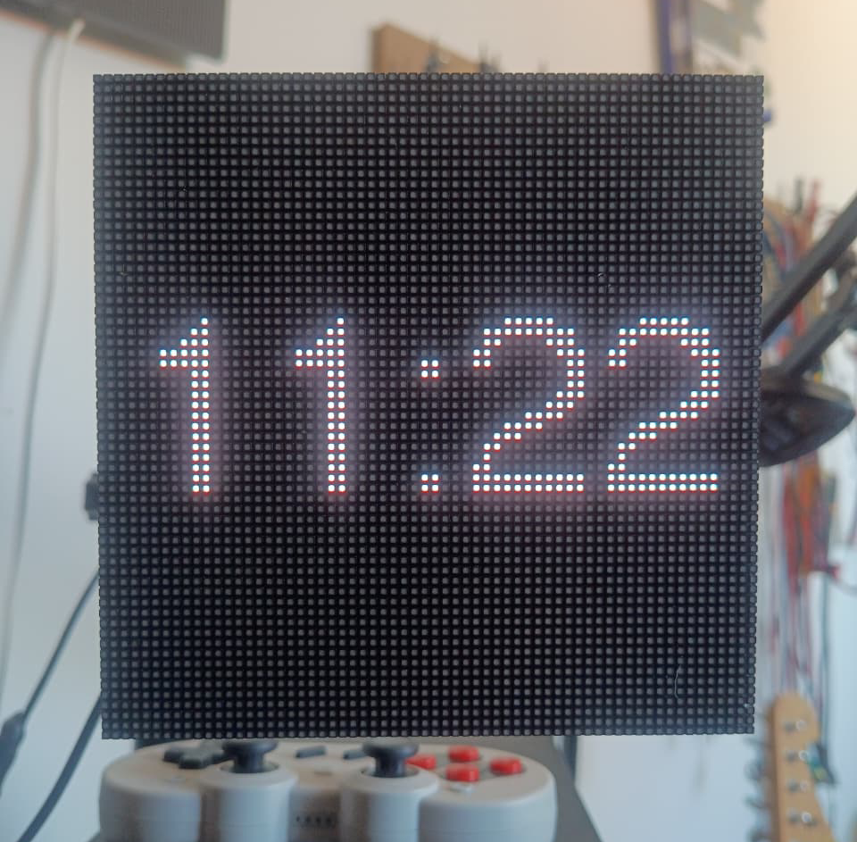
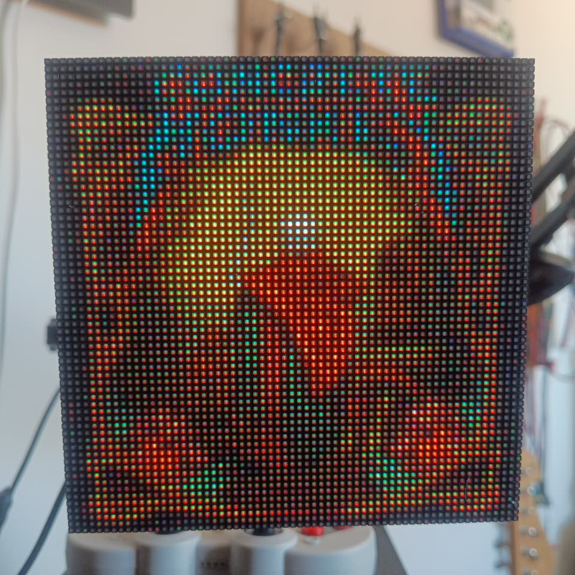
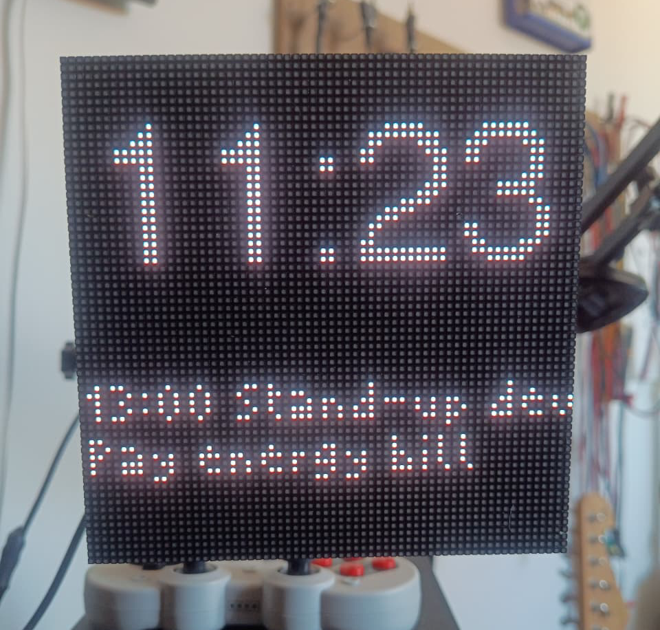
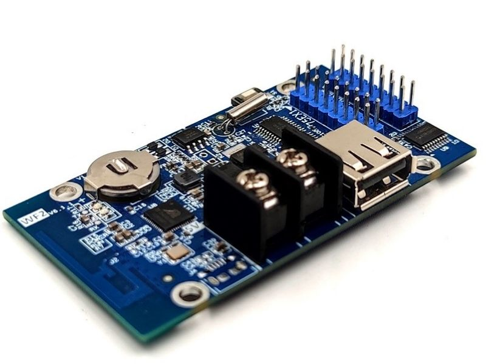

# Spotify Clock WF2

A real-time display system that shows your currently playing Spotify track on a 64×64 LED matrix, with color-temperature-aware clock animations and optional calendar integration.

## Features

- **Now Playing Display**: Shows album art from your currently playing Spotify track in full color on an LED matrix
- **Adaptive Clock**: Displays time with color temperature that shifts throughout the day (warm at night, cool during day)
- **Calendar Integration** (optional): Displays upcoming calendar events below the clock when idle

## Gallery

This one was connected to a 64x64 2mmm pitch smd1515 led matrix the I got from [Aliexpress](https://pt.aliexpress.com/item/1005001950053920.html?spm=a2g0o.order_list.order_list_main.127.1e9acaa4T398cf&gatewayAdapt=glo2bra). This one has both Red and Blue pins swaps so the config must be changed if you using another normal RGB led matrix. 

### Clock Display


### Album Art Display


### Calendar Integration


## Hardware Requirements

**Recommended Board:** [HUIDU HD-WF2](https://www.aliexpress.com/w/wholesale-HD-WF2.html) — A compact ESP32-S3 board with built-in HUB75 LED matrix driver interface and GPIO breakout pins.



**Compatible Alternatives:** Any ESP32-S3 microcontroller with enough available GPIO pins (minimum 20+ GPIOs) and USB support can work with this project by configuring the pin mapping in `include/config.h`.

### Core Requirements

- **ESP32-S3** microcontroller with USB support and 20+ available GPIO pins
- **HUB75 LED Matrix Driver** (onboard on HD-WF2, or external daughterboard)
- **64×64 RGB LED Matrix Panel** (HUB75 interface, standard module that use nornal shift-registers, the S-PWM are not supported by the lib yet)
- WiFi connectivity (built-in to ESP32-S3)

### Pin Configuration (WF2)

The project uses the WF2 pin mapping for the HUIDU HD-WF2 board's HUB75 LED matrix driver interface:

```
Color Pins (Port X1):
  R1: GPIO 10, R2: GPIO 11
  G1: GPIO 6,  G2: GPIO 7
  B1: GPIO 2,  B2: GPIO 3
  E:  GPIO 21

Control Pins:
  A: GPIO 39,  B: GPIO 38,  C: GPIO 37,  D: GPIO 36
  OE: GPIO 35, CLK: GPIO 34, LAT: GPIO 33
```

## Software Dependencies

- PlatformIO
- ESP32-HUB75-MatrixPanel-I2S-DMA
- SpotifyEsp32
- LittleFS (for image caching)
- JPEGDEC (for album art rendering)
- Arduino framework

See `platformio.ini` for the full dependency list.

## Getting Started

### 1. Clone the Repository

```bash
git clone https://github.com/raulzanardo/spotify_clock_wf2.git
cd spotify_clock_wf2
```

### 2. Create Configuration File

Copy the example configuration and fill in your credentials:

```bash
cp include/config.example.h include/config.h
```

### 3. Configure Spotify Credentials

Edit `include/config.h` and add:

- **CLIENT_ID** & **CLIENT_SECRET**: Register your app at [Spotify Developer Dashboard](https://developer.spotify.com/dashboard)
- **REFRESH_TOKEN**: Obtained after first successful authentication (the device will prompt it in the serial port any doupt you can check the tutorial in the [SpotifyEsp32](https://github.com/FinianLandes/SpotifyEsp32) library readme)
- **WIFI_SSID** & **WIFI_PASS**: Your WiFi network credentials
- **CALENDAR_URL** (optional): HTTP endpoint that returns newline-separated calendar events

### 4. Build, Upload & Monitor

Use the PlatformIO buttons in the VS Code extension to build, upload and open the serial monitor (bottom bar / status bar). This provides GUI actions for "Build", "Upload" and "Monitor".

## Configuration Reference

### Network Settings
```cpp
#define WIFI_SSID "Your_Network_Name"
#define WIFI_PASS "Your_Network_Password"
#define PROJECTNAME "spotify_clock_wf2"  // mDNS hostname
```

### Spotify API Credentials
```cpp
#define CLIENT_ID "your_spotify_client_id"
#define CLIENT_SECRET "your_spotify_client_secret"
#define REFRESH_TOKEN "your_spotify_refresh_token"
```
**Note:** Keep these credentials private! Never commit to public repositories.

### Time Settings
```cpp
#define TIME_ZONE "BRT3"              // Timezone (BRT3 = Brasília Time UTC-3)
#define UTC_OFFSET_SECONDS -10800     // UTC offset in seconds
#define ntpServer1 "pool.ntp.org"     // Primary NTP server
#define ntpServer2 "time.nist.gov"    // Fallback NTP server
```
**Common timezone values:** `PST8PDT` (Pacific), `EST5EDT` (Eastern), `CST6CDT` (Central), `GMT0` (UTC), `CET-1CEST` (Central Europe)

### Color Temperature Settings
```cpp
#define CONFIG_NIGHT_START_HOUR 22    // Night begins (0-23 format)
#define CONFIG_NIGHT_END_HOUR 6       // Night ends
#define CONFIG_NIGHT_TEMP 1500.0f     // Color temp at night (Kelvin)
#define CONFIG_MIN_TEMP 2000.0f       // Minimum color temp (warm)
#define CONFIG_MAX_TEMP 6500.0f       // Maximum color temp (cool)
#define CONFIG_NIGHT_DIM_FACTOR 0.3f  // Brightness at night (0.0-1.0)
```

### Pin Configuration (HD-WF2 specific)
```cpp
// Color pins (Port X1)
#define WF2_X1_R1_PIN 10
#define WF2_X1_R2_PIN 11
#define WF2_X1_G1_PIN 6
#define WF2_X1_G2_PIN 7
#define WF2_X1_B1_PIN 2
#define WF2_X1_B2_PIN 3
#define WF2_X1_E_PIN 21

// Control pins
#define WF2_A_PIN 39
#define WF2_B_PIN 38
#define WF2_C_PIN 37
#define WF2_D_PIN 36
#define WF2_OE_PIN 35
#define WF2_CLK_PIN 34
#define WF2_LAT_PIN 33
```
**For other boards:** Modify these pins to match your hardware connections.

### Calendar Integration (Optional)
```cpp
#define ENABLE_CALENDAR                               // Uncomment to enable
#define CALENDAR_URL "http://192.168.1.200/calendar"  // Your calendar endpoint
```
The calendar endpoint should return plain text with one event per line, e.g.:
```
Meeting at 2:00 PM
Lunch with team
Gym session 6:00 PM
```

### SpotifyEsp32 Feature Flags
Disable unwanted Spotify API features to reduce memory usage:
```cpp
#define DISABLE_AUDIOBOOKS
#define DISABLE_CATEGORIES
#define DISABLE_CHAPTERS
#define DISABLE_EPISODES
#define DISABLE_GENRES
#define DISABLE_MARKETS
#define DISABLE_PLAYLISTS
#define DISABLE_SEARCH
#define DISABLE_SHOWS
```
Only the essential playback data is fetched by default.

## Color Temperature Algorithm

The clock color shifts throughout the day based on Kelvin temperature:

- **Night (10 PM - 6 AM)**: 1500K warm light, dimmed to 30% brightness
- **Morning (6 AM - 12 PM)**: Gradually increases from 2000K to 6500K
- **Afternoon (12 PM - 6 PM)**: Gradually decreases from 6500K back to 2000K
- **Evening (6 PM - 10 PM)**: Cools down from 2000K toward night temp

This creates a natural, soothing display that adapts to your circadian rhythm.


## Calendar Integration

You can enable it in the config file: `include/config.h`

```cpp
// Calendar display (uncomment to enable)
// #define ENABLE_CALENDAR
```


If enabled, the device fetches calendar data from a configurable HTTP endpoint every 10 seconds when Spotify is idle. The endpoint should return plain text with events separated by newlines.

Example calendar provider script in `docs/calendar.example.sh` (included).

I used this approach on another device to reduce RAM usage on the ESP; I added this script to a local Debian server running Apache with CGI-enabled bash scripts.

## File Structure

```
src/main.cpp              # Main firmware code
include/config.h          # User configuration (keep private!)
include/config.example.h  # Configuration template
docs/                     # Documentation and helper scripts
  └── calendar.example.sh # Calendar script template
platformio.ini           # PlatformIO configuration
```

## Performance Notes

- Album art is downloaded and cached in LittleFS (reduces bandwidth)
- Spotify state is checked every 4 seconds
- Calendar is refreshed every 10 seconds (when music is idle)
- Color temperature calculation is done in integer math where possible

## License

MIT License

Copyright (c) 2025 raulzanardo

Permission is hereby granted, free of charge, to any person obtaining a copy
of this software and associated documentation files (the "Software"), to deal
in the Software without restriction, including without limitation the rights
to use, copy, modify, merge, publish, distribute, sublicense, and/or sell
copies of the Software, and to permit persons to whom the Software is
furnished to do so, subject to the following conditions:

The above copyright notice and this permission notice shall be included in all
copies or substantial portions of the Software.

THE SOFTWARE IS PROVIDED "AS IS", WITHOUT WARRANTY OF ANY KIND, EXPRESS OR
IMPLIED, INCLUDING BUT NOT LIMITED TO THE WARRANTIES OF MERCHANTABILITY,
FITNESS FOR A PARTICULAR PURPOSE AND NONINFRINGEMENT. IN NO EVENT SHALL THE
AUTHORS OR COPYRIGHT HOLDERS BE LIABLE FOR ANY CLAIM, DAMAGES OR OTHER
LIABILITY, WHETHER IN AN ACTION OF CONTRACT, TORT OR OTHERWISE, ARISING FROM,
OUT OF OR IN CONNECTION WITH THE SOFTWARE OR THE USE OR OTHER DEALINGS IN THE
SOFTWARE.

## Contributing

Contributions welcome! Please ensure:
- No secrets are committed (use `include/config.h` locally)
- Code follows existing style (const correctness, USBSerial debugging)
- Changes are tested on real hardware before PR

## Libraries & Resources

### Display & Graphics
- [ESP32-HUB75-MatrixPanel-I2S-DMA](https://github.com/mrfaptastic/ESP32-HUB75-MatrixPanel-I2S-DMA) — HUB75 LED matrix driver library
- [JPEGDEC](https://github.com/bitbank2/JPEGDEC) — JPEG decoder for embedded systems

### API & Connectivity
- [SpotifyEsp32](https://github.com/FinianLandes/SpotifyEsp32) — Spotify API client library for ESP32

### External APIs
- [Spotify Web API](https://developer.spotify.com/documentation/web-api) — Spotify playback state and metadata

## Inspiration & Credits

**Project inspired by:**
- [64x64 RGB LED Matrix Album Art Display on Pi 3B+](https://www.reddit.com/r/raspberry_pi/comments/ziz4hk/my_64x64_rgb_led_matrix_album_art_display_pi_3b/) — Original concept by the Raspberry Pi community
- [Live Spotify Album Art Display Tutorial](https://learn.sparkfun.com/tutorials/live-spotify-album-art-display/all) — SparkFun's guide to album art displays
- [Tuneshine](https://www.tuneshine.rocks/) - A full product that displays album art from spotify, apple music, sonos and last.fm.

**Built with help from:**
- [mrcodetastic's HD-WF1-WF2-LED-MatrixPanel-DMA](https://github.com/mrcodetastic/HD-WF1-WF2-LED-MatrixPanel-DMA) — Core driver library
- [ESP32-HUB75-MatrixPanel-DMA discussion](https://github.com/mrcodetastic/ESP32-HUB75-MatrixPanel-DMA/issues/433) — Troubleshooting and optimization insights
- [Eltopinovatif's HD-WF2 v7 implementation](https://github.com/Eltopinovatif/HD-WF2_v7-JWS-Assalaam) — Reference implementation for WF2 board

---

### My related projects

- [spotify_clock_mps3](https://github.com/raulzanardo/spotify_clock_mps3) — Another Spotify clock project with different hardware/approach.

---

**Enjoy your Spotify Clock!**
